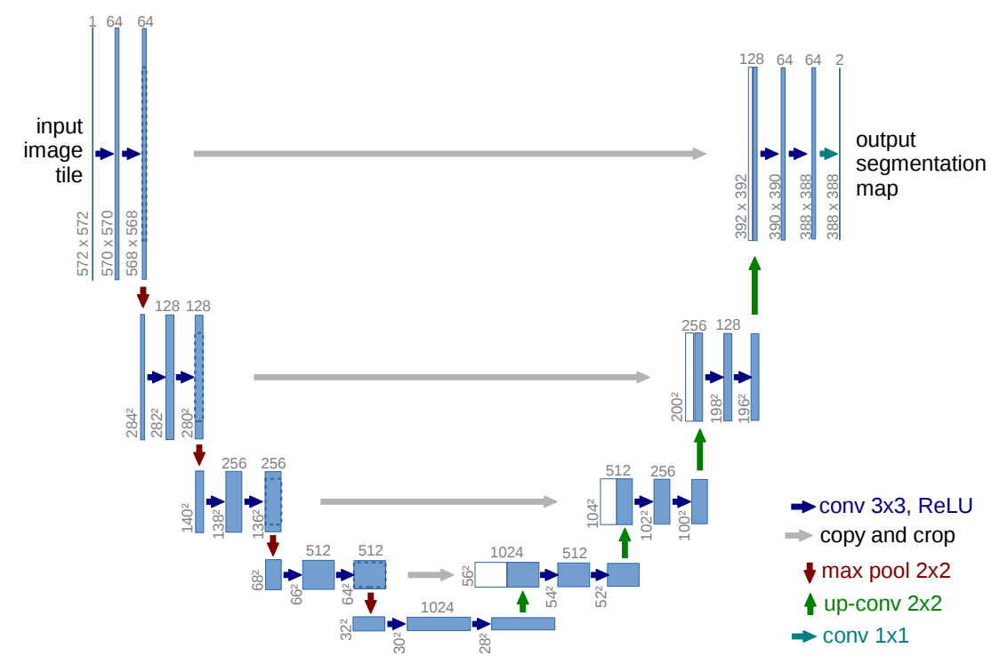
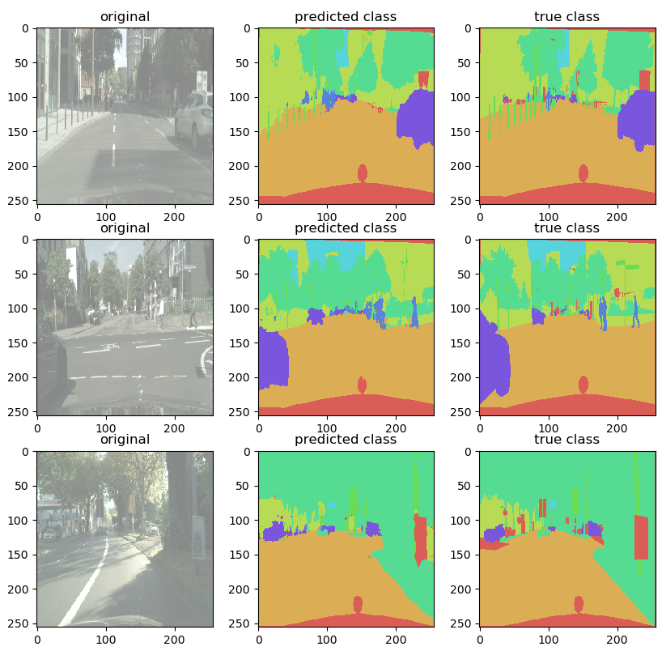

# Implementation of UNET for semantic segmentation with tensorflow 2.x 

The code repo was inspired by [U-Net: Convolutional Networks for Biomedical Image Segmentation](https://arxiv.org/pdf/1505.04597.pdf).

---

## Overview

### Data

The original dataset is from cityscape [eftImg8bit_demoVideo.zip (6.6GB)](https://www.cityscapes-dataset.com/downloads/) 
and [gtFine_trainvaltest.zip (241MB)](https://www.cityscapes-dataset.com/downloads/). It contains 3500 images from multiple 
cities in Europe and comes with finely annomated labeling images. Although it is open source, you need to create an account
to download these images.

### Data augmentation
As the number of images 3500 is decently large, thus I augumentation is really implemented. But the images and masks are 
read in to RAM on the fly with ImageDataGenerator.

### Model

This deep neural network is implemented with Keras functional API, which makes it extremely easy to experiment with different interesting architectures.

Output from the network is a 256*256 which represents mask that should be learned. Softmax activation function is chosen to pick up the most 
probable classes for each pixel.

### Training

The planned number of epoch is 100. Both ModelCheckpoint and EarlyStopping are adopted to prevent overfitting. After 46 epoch, 
the trainning stopped and achieve val_accuracy of 0.91 and mIoU of 68.2

## How to use

### Dependencies

This tutorial depends on the following libraries:

* Tensorflow 2.x
* Python 3.8

### Run main.py

Before running main.py, you need to download the training and testing images from cityscape as mention above, 
unzip the data, place them in data folder. Then run create_dataset.py, this will create a data structure needed by main.py.

### Results

Use the trained model to do segmentation on test images, the result is statisfactory.

    IoU(y_testi, y_predi)

    class 00:  # TP= 96121, #FP=  4868, #FN=51077, IoU=0.632
        class 01:  # TP=375257, #FP= 47927, #FN= 6246, IoU=0.874

            class 02:  # TP=232483, #FP= 30382, #FN=31860, IoU=0.789

            class 03:  # TP=  9355, #FP=  5289, #FN=13990, IoU=0.327

            class 04:  # TP=127484, #FP= 16921, #FN= 8389, IoU=0.834

            class 05:  # TP= 18878, #FP=  1802, #FN=  982, IoU=0.871

            class 06:  # TP= 13451, #FP= 14468, #FN= 5578, IoU=0.402

            class 07:  # TP= 46815, #FP=  7075, #FN=10610, IoU=0.726

            ____________________________________________________

    Mean
    IoU: 0.682

---

### Questions 

If you run into any issue when using this repo, please open an issue. 

